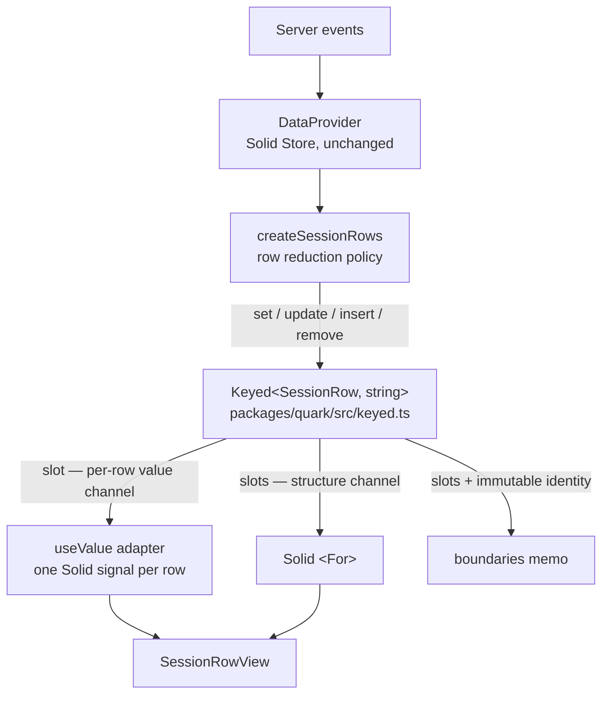

# Quark Timeline Architecture — and How It Can Be Faster

An architecture review of the `opencode-quark-timeline` experiment: what the layers are, why the design is sound, and the *mechanical* reason it can beat the Solid Store timeline — with the actual code.

## The Stack in One Picture

Four small layers, each with one job. The reusable core remains about 200 lines.



```tree
packages/quark/src
├── reactivity.ts   # 59 lines — Readable/Writable/Computed/Transaction over alien-signals
├── keyed.ts        # Keyed collection (the whole idea lives here)
├── solid.ts        # 8 lines — useValue: one quark Readable → one Solid signal
└── index.ts        # 2 lines — exports
```

The experimental boundary is disciplined: `DataProvider`, the event protocol,
rendered row policy, and `SessionRowView` are unchanged. Row ownership and the
incremental mutation mechanics changed; batch and live grouping now share one
policy helper. The boundary remains narrow enough to attribute regressions or
improvements.

## The Core Idea: Identity and Equivalence Are Inputs, Not Discoveries

This is the entire architectural bet. Solid Store must *discover* what changed; Quark is *told* what identity and sameness mean, once, at construction:

```typescript title="packages/tui/src/routes/session/rows.ts" caption="The complete reconciliation policy is two functions"
const state = Keyed.make({ key: rowKey, equivalent: sameRow })
```

`rowKey` answers *"which slot is this?"* — including the subtle case where a group's key is the ref that **created** it, so refs moving to `pending` can never change identity. Keys are precomputed once at row construction with length-prefixed segments, so reconciliation pays zero key-extraction work:

```typescript title="packages/tui/src/routes/session/rows.ts" caption="Keys are built once, at construction — rowKey is a field read"
export type SessionRow = { readonly id: string } & ( /* ...variants... */ )

function partRow(ref: PartRef): SessionRow {
  return { id: `p${segment(ref.messageID)}${segment(ref.partID)}`, type: "part", ref }
}

function segment(value: string) {
  return `${value.length}:${value}` // unambiguous without trusting a delimiter
}

function rowKey(row: SessionRow) {
  return row.id
}
```

`sameRow` answers a different question: *"can any consumer tell these two values apart?"* It compares only render-relevant fields. If it says yes-they're-the-same, **nothing downstream runs at all**.

## Two Channels Instead of One

A Solid Store exposes one reactive graph; every consumer subscribes into the same proxy web. `Keyed` splits change into two independent surfaces:

```typescript title="packages/quark/src/keyed.ts" start=4
export interface Keyed<A, Key> {
  readonly slots: Readable<readonly Readable<A>[]>   // fires ONLY on insert/remove/reorder
  readonly values: Readable<readonly A[]>            // fires on any current value change
  has(key: Key): boolean
  get(key: Key): Readable<A> | undefined
  set(values: readonly A[]): void
  update(value: A): boolean
  insert(value: A, position?: "end" | { before: Key } | { after: Key }): Readable<A>
  remove(key: Key): boolean
  move(key: Key, position?: "end" | { before: Key } | { after: Key }): boolean
}
```

```definitions
[
  { "term": "slots", "definition": "The structure channel. An array of stable per-row readables. Its identity changes only when membership or order changes. <For> subscribes here." },
  { "term": "slot", "definition": "The value channel. One writable signal per row identity. A streaming delta touches exactly one slot. The row's component subscribes here via useValue." },
  { "term": "values", "definition": "The aggregate channel. A lazy computed mapping slots to current values. The TUI uses it only for internal mutation snapshots and does not subscribe boundaries to it." }
]
```

This separation is what a proxy-based store cannot give you for free: **a value change and a structure change are different events**, published to different audiences.

## How It CAN Be Faster: One Unique Row Update, Step by Step

The highest-frequency reducer workload is a repeated streaming ordinal, which
the seen-part set rejects in expected `O(1)` before reading the aggregate. The
next useful comparison is a unique event that extends or completes an existing
group row. Trace that value update through both systems.

### Before: Solid Store path

```typescript caption="Old hot path — every access and write crosses a proxy"
setRows(produce((draft) => {
  // 1. draft is a proxy — every property read is a trap
  // 2. finding the group row walks proxied array elements
  // 3. the mutation writes through proxy machinery
  // 4. Solid records fine-grained dependencies per touched path
  append(draft, ref, part, queuedStart(draft))
}))
// ...and on reconnect / revert / rebuild:
setRows(reconcile(reduce()))
// reconcile must re-derive identity from item references,
// walk every row's shape, and diff against the proxy graph
```

Solid's generality — arbitrary nested access, partial path writes, plain objects — is paid for on **every operation** with proxy traps, shape inspection, and dependency bookkeeping.

### After: Quark path

The whole collection is a closure over three pieces of state — the structure signal, the identity map, and the declared equivalence. `update` reads directly against them:

```typescript title="packages/quark/src/keyed.ts" caption="The closure state update() operates on, plus the whole hot path"
export function make<A, Key>(options: {
  readonly key: (value: A) => Key
  readonly equivalent?: (left: A, right: A) => boolean
}): Keyed<A, Key> {
  const slots = State.make<readonly Writable<A>[]>([]) // structure channel: one signal holding the slot array
  const byKey = new Map<Key, Writable<A>>()            // identity → slot address, maintained by set/insert/remove
  const equivalent = options.equivalent ?? Object.is   // declared sameness (sameRow in the TUI)
  const values = Computed.make<readonly A[]>((previous) => {
    const next = slots().map((slot) => slot())         // aggregate channel, lazy until subscribed
    return same(previous, next) ? previous! : next
  })

  return {
    slots,
    values,
    // ...
    update(value) {
      const key = options.key(value)          // 1. one key extraction (a field read: row.id)
      const slot = byKey.get(key)             // 2. one Map lookup — an address, not a search
      if (!slot) throw new Error(`Keyed value does not exist: ${String(key)}`)
      if (equivalent(slot(), value)) return false // 3. one equivalence check — early cutoff
      slot.set(value)                         // 4. one signal write; slots is untouched
      return true
    },
    // ...
  }
}
```

Note what `update` never touches: `slots`. A value change writes one slot signal and the structure channel stays reference-identical — that single fact is the structural cutoff below.

Four operations. No proxies, no shape discovery, no graph diff. Then the adapter forwards the change to exactly one Solid signal:

```typescript title="packages/quark/src/solid.ts" caption="The entire Solid boundary — 8 lines"
export function useValue<A>(readable: Readable<A>): Accessor<A> {
  const [value, setValue] = createSignal(readable())
  onCleanup(readable.subscribe((next) => setValue(() => next)))
  return value
}
```

### The structural cutoff — why `<For>` never even wakes up

Because `slots` only fires on structural change, a value-only update leaves the outer array **reference-identical**. The `<For>` signal never fires, so keyed-list diffing never runs and the component owner survives:

```typescript caption="Value-only transition: structure untouched, owner preserved"
const structure = rows.slots()
const groupSlot = structure[0]

rows.update({ ...initial, completed: true })

rows.slots() === structure       // true — <For> receives no change at all
rows.slots()[0] === groupSlot    // true — component owner survives
groupSlot().completed === true   // true — the one subscribed row re-renders
```

This is also the **beauty** mechanism, not just speed: an expanded reasoning group keeps its local state through permission repartitioning, because refs moving between `refs` and `pending` is a value change on a stable identity — never a remount.

### The membership cutoff — duplicate deltas avoid the aggregate entirely

A route-scoped set contains every visible part identity, including refs nested
inside groups. A duplicate streaming delta dies at `seenParts.has(id)` before
reading `state.values()`. Duplicate message and footer events use `Keyed.has`
against the collection's existing key map. For a replacement that reaches
`update`, declared equivalence remains the final publication cutoff.

## More Before / After, From the Actual Diff

### Wiring the renderer: one `<For>`, two subscription levels

Before, every row component read its row through the store proxy, and any reconcile could disturb the list:

```tsx title="packages/tui/src/routes/session/index.tsx" caption="Before — one reactive graph for everything"
<For each={rows}>
  {(row, index) => (
    <SessionRowView row={row} ... boundaryID={boundaries()[index()]} />
  )}
</For>
```

After, `KeyedFor` subscribes to the structure channel and each row component subscribes to exactly one slot:

```tsx title="packages/tui/src/routes/session/index.tsx" caption="After — structure and value subscriptions are separate"
<KeyedFor each={rows.slots}>
  {(row, index) => (
    <SessionRowView row={row()} ... boundaryID={boundaries()[index()]} />
  )}
</KeyedFor>
```

### Appending a footer row

```typescript caption="Before — mutate a proxied draft; Solid infers what changed"
setRows(
  produce((draft) => {
    if (draft.some((row) => row.type === "assistant-footer" && row.messageID === messageID)) return
    const index = queuedStart(draft)
    completePrevious(draft, index)
    draft.splice(index, 0, { type: "assistant-footer", messageID })
  }),
)
```

```typescript caption="After — say exactly what happened: maybe one value update, then one insert"
mutate(() => {
  if (state.has(footerRowID(messageID))) return
  const current = state.values()
  const index = queuedStart(current)
  complete(current, index)                    // one state.update on the previous group, if open
  insert(current, index, footerRow(messageID)) // one new slot + one structural publication
})
```

Same policy, but the after version *names* its effects: at most one slot value change plus one structural change, flushed together by `Transaction.run`. Nothing has to diff anything to figure that out afterward.

### Removing a row

```typescript caption="Before — linear search, then splice through the proxy"
setRows(
  produce((draft) => {
    const index = draft.findIndex((row) => row.type === "assistant-footer" && row.messageID === messageID)
    if (index !== -1) draft.splice(index, 1)
  }),
)
```

```typescript caption="After — remove by identity; the ownership law does the rest"
mutate(() => {
  state.remove(footerRowID(messageID))
})
```

### Full rebuild (reconnect, revert, compaction)

```typescript caption="Before — reconcile re-derives identity from scratch"
setRows(reconcile(reduce()))
```

```typescript caption="After — set() reconciles with declared identity and equivalence"
setRows(reduce()) // → state.set(next): Map lookups + sameRow checks; unchanged rows publish nothing
```

This is the one place the two systems do comparable O(N) work — and it's exactly the workload the checked benchmark measured. Every path above it is where Quark does structurally *less*.

## The Cost Ledger

| Per operation | Solid Store (`produce`/`reconcile`) | Quark `Keyed` |
| --- | --- | --- |
| Find the row | proxied array walk / identity re-derivation | one `Map.get` |
| Detect "no change" | proxy-graph diff per touched path | one `equivalent()` call |
| Value change | proxy writes + per-path invalidation | one signal write → one Solid signal |
| Structure unchanged | reconcile still walks the list | outer array identity preserved; `<For>` silent |
| Structure changed | full reconcile | one new array; retained slots reused by reference |
| Batch of writes | store batching | one `Transaction.run` — settled publication |

Same asymptotics — `O(N)` for a whole-array `set` — but far fewer instructions, allocations, and invalidations per unit of change. **The speedup is a constant-factor win purchased with a stronger contract** (unique stable keys, declared equivalence), not framework magic. The checked-in claim: ~4.7× on sparse value publication, ~6.4× on reorder, at 1,000 rows.

## Architecture Verdict

### What's genuinely good

- **Deep module, tiny surface.** One small `keyed.ts` module carries the whole idea; the laws (unique key, stable key, equivalence, structural cutoff, settled publication, ownership) are explicit and testable.
- **The adapter is honest.** `useValue` is 8 lines and creates no second reconciliation system — the failure mode the design doc itself warns about.
- **Identity-as-input is the right call** for this domain: OpenCode *has* real identities (messageID, partID) and was previously throwing that information away for Solid to rediscover.
- **Falsifiable framing.** The docs predict where Quark should lose. That's rare and worth preserving.

### Where the architecture leaked — all fixed during review

Every leak identified in the first pass has since been closed:

- ~~**`JSON.stringify` keys.**~~ Keys are precomputed `id` fields built once at row construction with length-prefixed segments (`rows.ts` smart constructors); `rowKey` is a field read.
- ~~**The aggregate channel reintroduces O(N) per delta.**~~ `boundaries` now derives from the structure channel (`rows.slots()`) and reads slot values untracked (quark reads are invisible to Solid's tracker); the raw `values` readable is no longer mirrored into Solid. Per-delta boundary cost is zero; the O(N) recompute fires only on structural change or tracked `messages()` field changes.
- ~~**Boundary staleness as an implicit invariant.**~~ The untracked-read trick is now type-enforced: `messageBoundaryIDs` accepts `readonly BoundaryRow[]`, a projection of `Pick`ed identity-immutable fields, so a future dependence on a mutable row field is a compile error.
- ~~**Two grouping engines.**~~ Join-vs-insert policy is unified in `appendDecision` + `groupKind`; both the batch `reduce()` path and the incremental `appendPart` path consume it, and row construction goes through shared smart constructors.
- ~~**Benchmark not checked in / wrong hot path.**~~ `packages/quark/bench/` now exists and covers incremental `keyed.update` — including against Solid's *direct path write*, the adversarial case — plus dense updates and reorders.
- ~~**No work counters.**~~ `Keyed` accepts an optional `Metrics` sink; `OPENCODE_QUARK_METRICS=1` reports timeline counters on cleanup.
- ~~**Opaque positioning and adapter boilerplate.**~~ `insert` and `move` now share an explicit `Position` vocabulary (`"end"`, `before`, or `after`), `get` exposes stable slot addresses, and `KeyedFor` encapsulates the two-level Solid subscription.

The remaining asymmetry — `complete` (immutable `state.update`) vs `completePrevious` (in-place mutation on a plain array under construction) — is inherent to the two contexts, three lines each, and shares the same policy. Not worth abstracting.

None of these are structural flaws — they are integration debts. The layering itself (laws → Keyed → thin adapter → unchanged renderer) is the right shape, and it's the shape worth keeping even if every number in the current doc had to be re-measured.

See `quark-review-recommendations.md` for the prioritized fix list.
