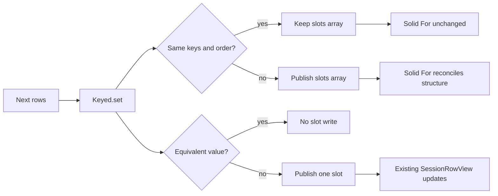

# Why Quark Can Be Faster Than Solid Store

Status: experimental performance model

## Conclusion

Quark can be faster than the current Solid Store timeline because it accepts a
stronger contract and uses that contract to do less runtime work.

The advantage does **not** come from TypeScript types by themselves. TypeScript
types disappear at runtime. The useful information comes from explicit runtime
inputs and API laws:

- A row key is unique and cannot change during its ownership lifetime.
- Row equivalence is supplied before updates begin.
- A keyed list has one stable slot per key.
- Value changes and structural changes publish through separate channels.
- A transaction publishes only settled graph state.

Those guarantees remove choices from the hot path. Quark does not need to
rediscover identity, shape, equivalence, index membership, or ownership on
every update. Less discovery means fewer comparisons, proxy traps,
allocations, writes, and downstream invalidations.

This is a conditional claim, not a claim that Quark is universally faster than
Solid. Solid can be as fast or faster when an application performs a precise
direct store write, when lists are tiny, or when Quark receives no useful
identity information. The relevant comparison is the current OpenCode path:
whole projected records and ordered rows are reconciled into a Solid Store.

## The Physical Argument Is “Do Less Work”

Software cannot escape the physical costs of instructions, memory reads,
allocations, pointer writes, cache misses, and notification fan-out. An
abstraction can only become faster by reducing those costs or arranging them
more favorably.

Quark's proposed advantage has four concrete sources:

1. **Declare repeated decisions once.** Identity and equivalence become
   preconfigured functions rather than per-event discovery.
2. **Replace searches with addresses.** Stable keys resolve to persistent
   slots through a `Map`.
3. **Separate unrelated change dimensions.** An item value can change without
   publishing a new list structure.
4. **Stop propagation early.** Schema equivalence and slot equivalence suppress
   writes before they reach Solid or the terminal renderer.

These are ordinary computer costs, not framework mythology. If profiling shows
that Quark executes the same work as Solid plus an adapter, the hypothesis is
false. If counters show fewer structural publications, fewer component-owner
reconciliations, and fewer proxy/store operations, the speedup has a mechanical
explanation.

## Solid Store Must Preserve Generality

The current timeline asks Solid Store to accept ordinary JavaScript objects and
reconcile new projections into a proxy-backed graph.


Solid's generality is valuable. It can react to arbitrary nested property
access, partial path writes, and plain objects without requiring a schema-owned
model. That generality also means the runtime must maintain proxy metadata and
interpret each reconciliation against the current store graph.

Solid is not inherently inefficient. A precise call such as
`setStore(index, "value", next)` can avoid whole-list reconciliation. OpenCode's
timeline frequently receives whole projected messages or rebuilt row arrays,
however, so its current implementation uses `produce` and `reconcile` to
recover identity and preserve nested owners.

## Quark Makes Identity an Input

`Keyed` receives the identity and equivalence functions when the collection is
created. In the TUI, every row carries a collision-safe primitive `id`. Groups
also retain their immutable origin for message-boundary projection:

```typescript
type PartRef = {
  messageID: string
  partID: string
}

type SessionRow = { readonly id: string } & (
  | { type: "message"; messageID: string }
  | { type: "compaction-queued"; inputID: string }
  | { type: "part"; ref: PartRef }
  | {
      type: "group"
      kind: "reasoning"
      origin: PartRef
      refs: PartRef[]
      completed: boolean
    }
  | {
      type: "group"
      kind: "exploration"
      origin: PartRef
      refs: PartRef[]
      pending: PartRef[]
      completed: boolean
    }
  | { type: "assistant-footer"; messageID: string }
)
```

Factories build the ID once with length-prefixed segments. Length prefixes
avoid delimiter collisions without invoking a serializer:

```typescript
function segment(value: string) {
  return `${value.length}:${value}`
}

function groupRow(kind: "reasoning" | "exploration", origin: PartRef): SessionRow {
  const id = `g${kind === "reasoning" ? "r" : "e"}${segment(origin.messageID)}${segment(origin.partID)}`
  if (kind === "reasoning") return { id, type: "group", kind, origin, refs: [origin], completed: false }
  return { id, type: "group", kind, origin, refs: [origin], pending: [], completed: false }
}

function rowKey(row: SessionRow) {
  return row.id
}
```

`sameRow` answers a different question: can consumers distinguish these two
values for the same identity? It compares only fields that affect row
rendering.

```typescript
function sameRow(left: SessionRow, right: SessionRow) {
  if (left.type !== right.type) return false

  if (left.type === "message" && right.type === "message") return left.messageID === right.messageID

  if (left.type === "compaction-queued" && right.type === "compaction-queued") return left.inputID === right.inputID

  if (left.type === "part" && right.type === "part") return sameRef(left.ref, right.ref)

  if (left.type === "assistant-footer" && right.type === "assistant-footer") return left.messageID === right.messageID

  if (left.type !== "group" || right.type !== "group") return false
  if (left.kind !== right.kind) return false
  if (left.completed !== right.completed) return false
  if (!sameRefs(left.refs, right.refs)) return false

  if (left.kind === "reasoning" || right.kind === "reasoning") return true
  return sameRefs(left.pending, right.pending)
}

function sameRefs(left: PartRef[], right: PartRef[]) {
  return left.length === right.length && left.every((ref, index) => sameRef(ref, right[index]))
}

function sameRef(left: PartRef, right: PartRef) {
  return left.messageID === right.messageID && left.partID === right.partID
}
```

Those functions form the complete reconciliation policy:

```typescript
const rows = Keyed.make<SessionRow, string>({
  key: rowKey,
  equivalent: sameRow,
})

rows.set(nextRows)
```

It exposes two reactive surfaces:

```typescript
rows.slots // changes only when keys are inserted, removed, or reordered
rows.values // changes when any current value changes
```

Each slot is itself a readable value. Solid `<For>` receives `slots`, so a
group can grow or complete without replacing its component owner. Generic
aggregate consumers can subscribe to `values` when they need every value
change.

The TUI's message-boundary projection deliberately does not subscribe to
`values`. Boundary identity uses only immutable row fields, so it tracks the
structural `slots` array and reads each slot value untracked. Value-only deltas
therefore perform no boundary work; inserts, removals, reorders, or message
changes recompute boundaries.

Here is a complete value-only transition. The group changes, but its key and
position do not:

```typescript
const origin = { messageID: "assistant-1", partID: "call-read" }
const initial = groupRow("exploration", origin)

rows.set([initial])

const structure = rows.slots()
const groupSlot = structure[0]

rows.update({
  ...initial,
  completed: true,
})

rows.slots() === structure // true: <For> receives no structural change
rows.slots()[0] === groupSlot // true: component owner survives
groupSlot().completed === true // true: row value updated
```

A structural insertion changes the outer list but preserves every retained
slot:

```typescript
const footer: SessionRow = {
  id: "f11:assistant-1",
  type: "assistant-footer",
  messageID: "assistant-1",
}

const footerSlot = rows.insert(footer)

rows.slots().length === 2 // true
rows.slots()[0] === groupSlot // true
rows.slots()[1] === footerSlot // true
```

Removing and later reinserting a key begins a new ownership lifetime:

```typescript
rows.remove(footer.id)
const nextFooterSlot = rows.insert(footer)

nextFooterSlot === footerSlot // false
```



The key distinction is that **row identity is not inferred from row value**.
The timeline gives every reasoning or exploration group an immutable creation
key. Permission partitioning may move refs between `refs` and `pending`, but it
cannot change the group slot or reset local expanded state.

## The `Keyed.set` Algorithm

The current algorithm is deliberately small:

```text
set(next):
  1. Compute every next key and reject duplicates.
  2. Build Map<key, previousSlot>.
  3. For each next value:
       a. Reuse the previous slot for its key, or create one.
       b. Compare previous and next values.
       c. Write only a changed slot.
  4. Publish the outer slot array only if membership or order changed.
  5. Flush slot and structural writes in one transaction.
```

The aggregate `values` readable maps the current slots to their values. It is a
computed node, so it remains lazy without subscribers and publishes one settled
array when subscribed.

The algorithm preflights duplicate keys before any slot mutation. A rejected
set therefore cannot partially update the graph. `Map` and `Set` give keys
SameValueZero semantics, including consistent treatment of `0`/`-0` and
`NaN`.

## The Laws That Unlock the Optimizations

```definitions
[
  {
    "term": "Unique key law",
    "definition": "No two current values have the same key. This permits one Map entry and one slot per identity."
  },
  {
    "term": "Stable key law",
    "definition": "An entity or logical row keeps its key for its lifetime. This permits component ownership and subscriptions to survive value changes."
  },
  {
    "term": "Equivalence law",
    "definition": "If equivalent(left, right) is true, publishing right cannot change any consumer-visible meaning. This permits early cutoff."
  },
  {
    "term": "Structural cutoff law",
    "definition": "Value-only updates preserve the exact outer slots-array identity. This prevents keyed-list reconciliation for non-structural changes."
  },
  {
    "term": "Settled publication law",
    "definition": "Subscribers observe the state after every slot and structural write in the operation, never a partial combination."
  },
  {
    "term": "Ownership law",
    "definition": "Removing a key removes its slot from the collection. Reinserting that key creates a fresh slot; old external references cannot attach to a new lifetime."
  }
]
```

These laws are stronger than a plain `Array<object>` contract. They are also
testable. Quark should reject a violated unique-key law and should have direct
tests for every other law.

## Fixed Layout Research Is Deferred

The standalone laboratory applies the same idea to records. The initial prototype
used Effect Schema, but its derived equivalence measured `1.621x` the hand
comparator's direct-update cost. Quark now experiments with a smaller trusted
in-memory `Layout` that compiles:

- field names into numeric positions;
- field changes into a bit mask;
- field equivalence into precomputed functions;
- entity keys and indexed fields into fixed metadata.

The minimal API marks the key in the shape itself:

```typescript
const ItemLayout = Layout.struct({
  id: Layout.key(Layout.number),
  value: Layout.number,
})

const ItemPlan = Layout.compile(ItemLayout)
const items = ItemPlan.make([
  { id: 1, value: 10 },
  { id: 2, value: 20 },
])

items.update({ id: 2, value: 21 })
```

`ItemPlan` exposes the original field metadata, compiled key field, compiled
equivalence, and collection factory. Simple struct comparison has measured
near handwritten speed, but a representative nested session-row union measured
`1.322x` the handwritten keyed-update cost after closure specialization.
Generated comparison can remove more indirection, but it is optional research,
not a requirement for this timeline experiment.

A one-field record replacement can first compute the change mask, then write
only changed field slots. An indexed-field write knows exactly which index
buckets to remove from and add to. An entity upsert resolves directly through
its immutable key.

The static information is therefore not “the compiler knows the type.” It is
“the runtime has already compiled the layout and the application has agreed to
obey its laws.” Effect Schema can still validate or transform data at an
admission boundary without participating in collection updates. None of this
`Layout`, model, mask, index, or columnar-storage machinery is vendored into the
TUI fork. The current landing remains the small `Keyed` abstraction plus the
route reducer; broader promotion requires separate evidence.

## Asymptotics and Constants

For a whole next array of `N` keyed values, both Quark `Keyed.set` and a general
keyed reconciliation are `O(N)`. Quark does not break a lower bound: it must
read the next keys to validate and order them.

The observed win is currently a **constant-factor win at the same asymptotic
complexity**:

- one key extraction per next item; previous slots are already indexed;
- one `Map` lookup per next item;
- one explicit equivalence check;
- one slot write per changed value;
- one outer write only for changed structure;
- no general nested proxy reconciliation inside Quark.

For direct collection operations, stronger bounds are possible. An immutable
key lets `Keyed.update` or `Collection.upsert` find an entity in expected `O(1)`
time, after which work is proportional to changed fields and affected declared
indexes rather than total collection size. The TUI now uses event-native
`update`, `insert`, and `remove` operations for live events; full synchronization
and revert rebuilds still use linear `set`.

## Controlled Benchmark Evidence

The benchmarks are checked into the fork and run directly:

```bash
cd packages/quark
bun run bench:keyed
bun run bench:row-key
```

Each invocation interleaves and rotates variants over nine measured samples
after a discarded warmup. It reports median nanoseconds per operation, median
absolute deviation, machine-readable metrics, and a checksum.

The original whole-array benchmark established the initial direction:

| Workload                                     | Run |    Quark | Solid Store | Quark / Solid |
| -------------------------------------------- | --: | -------: | ----------: | ------------: |
| One value changes in a 1,000-item next array |   1 | 177.2 us |    863.7 us |        0.207x |
| One value changes in a 1,000-item next array |   2 | 158.8 us |    755.6 us |        0.213x |
| Reorder a 1,000-item list                    |   1 | 155.3 us |  1,020.8 us |        0.157x |
| Reorder a 1,000-item list                    |   2 | 147.1 us |    975.6 us |        0.152x |

Across these two invocations:

- keyed value publication was approximately **4.7x-4.8x faster**;
- keyed reorder was approximately **6.4x-6.6x faster**.

The checksum was stable, and both variants performed the same next-array
construction inside their timed workloads.

The refreshed integration benchmark measures event-native updates with the
aggregate `values` channel subscribed, plus adverse workloads. The July 17,
2026 evidence run produced:

| Workload                                  |       Quark |       Solid | Quark / Solid |
| ----------------------------------------- | ----------: | ----------: | ------------: |
| Direct update, no subscribers, 1,000      |     46.8 ns |    761.6 ns |        0.068x |
| Precise Solid path write, 1,000            |     54.3 ns |    327.5 ns |        0.170x |
| Subscribed aggregate, 10 rows             |    608.0 ns |      7.4 us |        0.085x |
| Subscribed aggregate, 100 rows            |      4.4 us |     80.0 us |        0.055x |
| Subscribed aggregate, 1,000 rows          |     37.4 us |    703.1 us |        0.052x |
| Subscribed aggregate, 10,000 rows         |    388.5 us |      8.1 ms |        0.044x |
| Dense 1,000-row update                    |    270.2 us |      2.3 ms |        0.132x |
| Unstable keys, 100 rows                   |     68.0 us |    245.2 us |        0.282x |

A second independent invocation produced paired ratios of `0.084x`,
`0.170x`, `0.077x`, `0.059x`, `0.061x`, `0.042x`, `0.130x`, and `0.266x`
in the same row order. The direct-path result reproduced exactly to three
decimal places; the other workloads retained the same direction and broad
magnitude despite normal timing variance.

The aggregate path is still `O(N)`, but it remained substantially cheaper than
the equivalent Solid Store projection. The precise direct-path case was added
specifically to favor Solid: it calls `setValues(index, "value", next)` while
Quark still constructs and compares a replacement object. The predicted Solid
win did not occur in this environment; Quark measured `0.170x`. This is a
falsified prediction for this setup, not evidence that Solid can never win a
direct-write comparison. The production TUI has no aggregate subscriber; it
tracks structural slots and immutable boundary metadata instead.

Key extraction was measured independently over 10,000 representative rows:

| Key strategy                            |      Median | Paired ratio to JSON |
| --------------------------------------- | ----------: | -------------------: |
| `JSON.stringify` tuple                  | 109.6 ns/op |               1.000x |
| Collision-safe length-prefixed string   |  25.6 ns/op |               0.205x |
| Precomputed primitive row ID field read |   8.7 ns/op |               0.075x |

The TUI now uses the precomputed primitive ID strategy.

## What the Benchmark Does Not Prove

The suite compares whole-array reconciliation, direct point updates, subscribed
aggregate projection, dense changes, unstable keys, and key extraction. It
does not prove that Quark beats:

- every Solid keyed-list primitive;
- rendering, terminal layout, or paint;
- all list sizes and mutation distributions;
- a complete OpenCode session under real provider and tool traffic.

The end-to-end `opencode-drive` runs establish behavioral parity, including
visible terminal completion and projected reasoning/text content. Their timing
varied too widely to support a speed claim because it includes provider
simulation, process scheduling, event transport, terminal rendering, and UI
polling.

## When Quark Should Lose

The design predicts smaller or negative gains when:

- lists are so small that setup and adapter costs dominate;
- keys are unstable or expensive to compute;
- equivalence is more expensive than simply publishing;
- almost every item and the structure change on every operation;
- there are no subscribers, so reactive precision has no downstream value;
- Solid receives a cheaper primitive update while Quark must perform a more
  expensive projection or whole-array reconciliation;
- copying the next application-level projection dominates both runtimes;
- the Quark-to-Solid adapter duplicates work rather than cutting it off.

These are falsifiable predictions. The current adverse suite did not find a
Solid win, including the newly added precise path write, but it preserves these
cases so future changes cannot optimize only the favorable sparse path.

## The Next Tests Must Measure Work, Not Just Time

The strongest next experiment is a single-binary A/B implementation driven by
one deterministic event trace. It should count:

| Deterministic transition       | Slot delta | Structure delta | Observed ownership behavior                 |
| ------------------------------ | ---------: | --------------: | ------------------------------------------- |
| First exploration part         |         +0 |              +1 | New group slot                              |
| Extend exploration group       |         +1 |              +0 | Existing group slot retained                |
| Permission repartition         |         +1 |              +0 | Existing group slot retained                |
| Insert queued user row         |         +0 |              +1 | Group remains mounted and incomplete        |
| Complete promoted-input group  |         +1 |              +0 | Existing group slot retained                |
| Duplicate text delta           |         +0 |              +0 | Returns before aggregate materialization    |
| Full unchanged two-row rebuild |         +0 |              +0 | Two equivalence suppressions, no publication |

`Keyed` exposes optional counters for slot publications, structural
publications, and equivalence suppressions. The focused TUI trace
`completes exploration when a queued prompt is promoted` records the first five
transitions and asserts the same slot identity across extension, repartition,
and completion. `does not publish timeline rows for duplicate streaming
deltas` records the duplicate path. The direct Keyed law test records the full
unchanged rebuild. Boundary tests independently assert that value-only changes
do not invalidate structural boundary projection.

## Decision Rule

Continue the Quark timeline experiment if deterministic replay confirms all of
the following:

1. Behavior and component ownership remain equivalent to the Solid baseline.
2. Value-only events publish no structural changes.
3. CPU or allocation cost improves on the real event distribution.
4. The Solid adapter remains a thin boundary rather than a second reactive
   system doing duplicate work.
5. The reusable `Keyed` and layout laws contain the complexity; TUI code
   does not grow its own reconciliation engine.

If those conditions fail, the standalone microbenchmarks are not sufficient
reason to replace Solid Store. If they hold, the speedup is not mysterious:
Quark is faster because OpenCode supplied stronger information and Quark used
that information to execute less work.

The current evidence satisfies ownership, structural cutoff, adapter
thinness, and containment in `Keyed`. Controlled workloads and the
deterministic TUI trace show lower CPU work for the exercised event shapes.
That is enough to continue and land the timeline experiment, not to claim a
universal framework win. Real-session soak remains the check on whether the
measured event distribution matches production usage.
